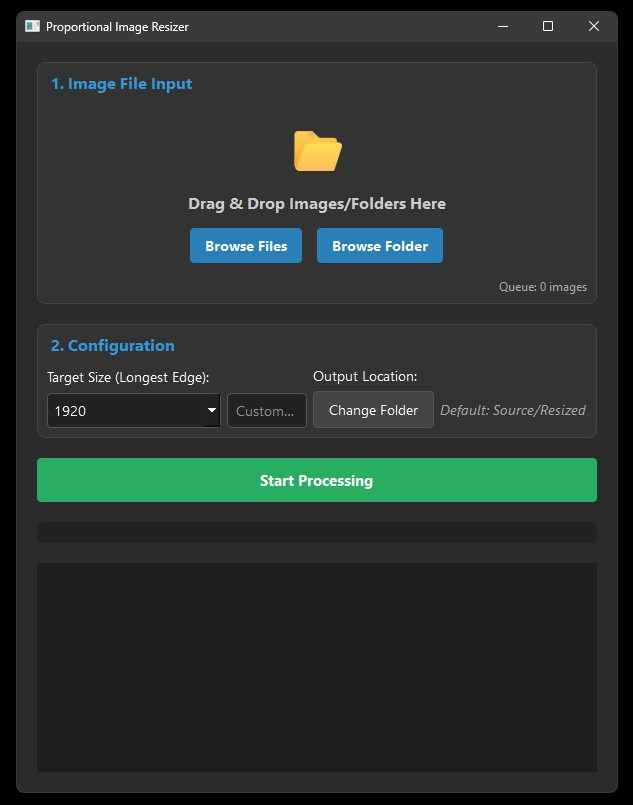

# Proportional Image Resizer
**by Pure Mint Software**

A high-performance, modern desktop utility designed to batch resize images while strictly maintaining their aspect ratio. Built with a dark-mode GUI, it leverages multiprocessing to handle large queues of images rapidly. It automatically scans folders (and subfolders), processes images to a target "longest side" dimension, and outputs them to a new folder, ensuring your original files remain untouched.


## App Preview

<p align="center">
  
</p>

## Major Functionality

*   **Smart Proportional Sizing:** Resizes images based on the longest edge (width or height). Whether the image is Portrait, Landscape, or Square, the longest side becomes your target pixel size, and the shortest side scales automatically to match.
*   **High-Performance Processing:** Utilizes Python's `multiprocessing` to run tasks across all available CPU cores, making it significantly faster than standard linear scripts.
*   **Modern GUI:** A clean, dark-themed interface built with PyQt6.
*   **Drag & Drop Support:** Simply drag images or entire folders directly into the application window.
*   **Recursive Scanning:** When a folder is dropped, the app automatically finds all images inside it, including those in sub-directories.
*   **Flexible Scaling:**
    *   **Downscaling:** Shrinks high-res photos to manageable web sizes.
    *   **Upscaling:** intelligently enlarges smaller images using high-quality LANCZOS resampling.
*   **Customization:** Select from common preset resolutions (512px - 4096px) or input a custom pixel value.
*   **Auto-Dependency Check:** The script includes a self-bootstrapper. If you don't have the required libraries installed, the script detects this and installs them automatically upon first launch.

## Tech Stack

*   **Python 3:** Core logic.
*   **PyQt6:** Modern, cross-platform GUI framework.
*   **Pillow (PIL):** Robust image processing and LANCZOS resampling algorithms.
*   **Multiprocessing:** Native Python concurrency for maximizing hardware efficiency.

## Example Scenario

You have a folder called "Cat Memes" containing a mix of different shapes and sizes. You set the **Target Size** to **1000px**.

1.  **2000 x 1000** (Landscape) becomes **1000 x 500** (Downscaled).
2.  **300 x 400** (Portrait) becomes **750 x 1000** (Upscaled).
3.  **1583 x 1583** (Square) becomes **1000 x 1000** (Downscaled).
4.  **500 x 1000** (Portrait) remains **500 x 1000** (Copied exactly, no quality loss).

## Installation & Requirements

This script requires **Python 3**.

Because the script includes an **auto-installer**, you generally do not need to install libraries manually. However, if you prefer to set up your environment beforehand, the required packages are:

```bash
pip install PyQt6 Pillow
```

## Running The Script

1.  Download `pir.pyw` to your desired folder.
2.  Open **CMD** or **PowerShell** and navigate to that folder.
3.  Run the following command:

```bash
python pir.pyw
```

*Note: On the first run, if you are missing libraries, a dialog box will appear letting you know that the system is installing the necessary dependencies. The app will restart automatically once finished.*

## Support

**If you find Proportional Image Resizer useful, please give it a star by hitting the button up in the top right corner! ⭐**
